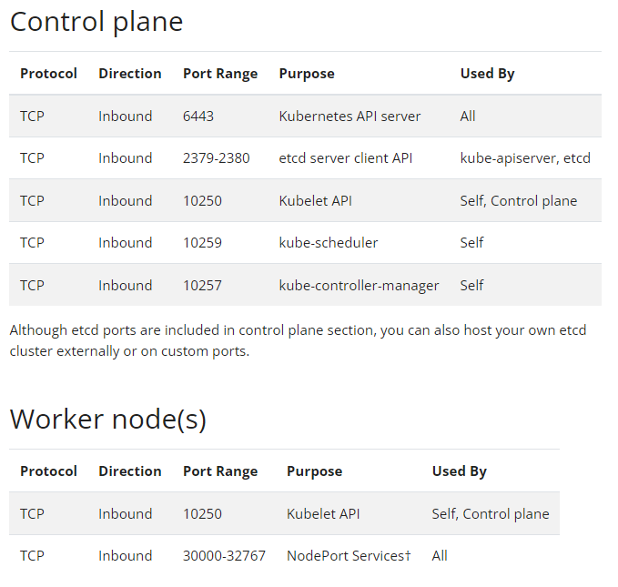

# All steps to set up Kubernetes cluster with one master and one worker nodes.

# Run tasks 01, 02, 03 on master as well as worker nodes.
## Task 01 - Install docker (master as well as worker nodes)
https://docs.docker.com/engine/install/ubuntu/

Do ssh to the machine.

```console
ssh -i C:DMZ1.pem ubuntu@XX.XXX.XXX.XX
```

Install docker
```console
sudo apt-get update
sudo apt-get install \
    ca-certificates \
    curl \
    gnupg \
    lsb-release
curl -fsSL https://download.docker.com/linux/ubuntu/gpg | sudo gpg --dearmor -o /usr/share/keyrings/docker-archive-keyring.gpg
echo \
  "deb [arch=$(dpkg --print-architecture) signed-by=/usr/share/keyrings/docker-archive-keyring.gpg] https://download.docker.com/linux/ubuntu \
  $(lsb_release -cs) stable" | sudo tee /etc/apt/sources.list.d/docker.list > /dev/null
sudo apt-get update
sudo apt-get install docker-ce docker-ce-cli containerd.io -y
sudo usermod -aG docker $USER
```

Exit from the machine.
```console
exit
```

Do ssh again to the machine.
ssh -i C:DMZ1.pem ubuntu@XX.XXX.XXX.XX

Verify docker status
```console
docker info
```

## Task 02 - Install Kubernetes (master as well as worker nodes)
Do ssh to the machine.

```console
ssh -i C:DMZ1.pem ubuntu@XX.XXX.XXX.XX
```

```console
curl -s https://packages.cloud.google.com/apt/doc/apt-key.gpg | sudo apt-key add
sudo apt-add-repository "deb http://apt.kubernetes.io/ kubernetes-xenial main"
sudo apt-get install kubeadm kubelet kubectl -y
sudo apt-mark hold kubeadm kubelet kubectl
sudo swapoff -a
sudo sed -i '/ swap / s/^/#/' /etc/fstab
sudo hostnamectl set-hostname k8s-master-01/k8s-node-01/k8s-node-02
```

Reboot the machine.
```console
sudo reboot
```
## Task 03 - Change container runtime cgroup drive to systemd (master as well as worker nodes)
Do ssh to the machine.

```console
ssh -i C:DMZ1.pem ubuntu@XX.XXX.XXX.XX
```

https://kubernetes.io/docs/tasks/administer-cluster/kubeadm/configure-cgroup-driver

https://kubernetes.io/docs/setup/production-environment/container-runtimes/

Check that below file either has systemd for container runtime cgroup driver, or nothing explicitly mentioned at all.
Kubernetes recommends systemd.
```console
sudo cat /etc/systemd/system/kubelet.service.d/10-kubeadm.conf | grep systemd
```

Output might be like this:
Environment="KUBELET_KUBECONFIG_ARGS=--bootstrap-kubeconfig=/etc/kubernetes/bootstrap-kubelet.conf --kubeconfig=/etc/kubernetes/ kubelet.conf --cgroup-driver=systemd"

Check docker driver
```console
docker info | grep 'group Driver'
```

### Change docker to use systemd, if needed
```console
sudo mkdir /etc/docker
#Add below lines to /etc/docker/daemon.json
cat <<EOF | sudo tee /etc/docker/daemon.json
{
  "exec-opts": ["native.cgroupdriver=systemd"],
  "log-driver": "json-file",
  "log-opts": {
    "max-size": "100m"
  },
  "storage-driver": "overlay2"
}
EOF
```

Restart docker to effect the driver change.

```console
sudo systemctl enable docker
sudo systemctl daemon-reload
sudo systemctl restart docker
```

## Task 04 - Init Kubernetes (run on master only)

Kubenetes cluster is initialized using kubeadm binary.

Do ssh to the machine.

```console
ssh -i C:DMZ1.pem ubuntu@XX.XXX.XXX.XX
```

Install net-tools to get ifconfig binary.
```console
sudo apt install net-tools
```
Clean up any old Kubernetes installation. Be careful and sure.
```console
sudo kubeadm reset -f
```

All EC2 Instances get IP from the host CIDR. (--apiserver-advertise-address)\
All Pods in Kubernetes will get IP from the Pod CIDR. (--pod-network-cidr)\
All Kubernetes Services get clusterIPs from Service CIDR. (--service-cidr)

What is POD network CIDR in Kubernetes?
* Kubernetes assigns each node a range of IP addresses, a CIDR block, so that each Pod can have a unique IP address. The size of the CIDR block corresponds to the maximum number of Pods per node.

* Init can be done in many ways. All or few or none of the options can be given. If none of the CIDR parameters given, then kubernetes takes default ones which can work in many cases but it is also good to give custom values to have full control of the configuration.
* Parameter --ignore-preflight-errors can be given to suppress capacity related or other errors, if needed.
* Parameter --v controls the verbosity level of the output.

--apiserver-advertise-address -> the private IP of current machine (it can be public IP too. But, then worker nodes will have to communicate over the public internet. So, it is better to use private IP only.)

--pod-network-cidr -> choose a CIDR which is not in use or doesn't exist yet. We need to give same value later while applying the Kubernetes networking model.

--service-cidr -> choose a CIDR which is not in use or doesn't exist yet.

Get private IP of EC2 machine:
```console
curl http://169.254.169.254/latest/meta-data/local-ipv4
```

Get public IP of EC2 machine:
```console
curl http://169.254.169.254/latest/meta-data/public-ipv4
curl http://checkip.amazonaws.com
```

Example commands:
```
sudo kubeadm init
sudo kubeadm init --service-cidr 10.96.0.0/12
sudo kubeadm init --pod-network-cidr=10.244.0.0/16 --ignore-preflight-errors=NumCPU --v=9
sudo kubeadm init --apiserver-advertise-address=192.168.0.111 --pod-network-cidr=10.244.0.0/16 --service-cidr 10.240.0.0/12 --kubernetes-version v1.22.2 --ignore-preflight-errors=NumCPU --v=5
```
Here, we are using below one. Replace apiserver with private ip of the master server.

Run below command:
```console
sudo kubeadm init --apiserver-advertise-address=172.31.45.213 --pod-network-cidr=10.244.0.0/16 --service-cidr 10.96.0.0/12 --ignore-preflight-errors=NumCPU,Mem --v=5
```

You will see output like below:
```
....
....
[addons] Applied essential addon: CoreDNS
[addons] Applied essential addon: kube-proxy

Your Kubernetes control-plane has initialized successfully!

To start using your cluster, you need to run the following as a regular user:

  mkdir -p $HOME/.kube
  sudo cp -i /etc/kubernetes/admin.conf $HOME/.kube/config
  sudo chown $(id -u):$(id -g) $HOME/.kube/config

Alternatively, if you are the root user, you can run:

  export KUBECONFIG=/etc/kubernetes/admin.conf

You should now deploy a pod network to the cluster.
Run "kubectl apply -f [podnetwork].yaml" with one of the options listed at:
  https://kubernetes.io/docs/concepts/cluster-administration/addons/

Then you can join any number of worker nodes by running the following on each as root:

kubeadm join 172.31.45.213:6443 --token en5mr7.33h89rt55lrwrsik \
        --discovery-token-ca-cert-hash sha256:872b7fe83a97de024031ffdb4a0ca0e0174f4c68470d17f57806cea019c15030
```

In case, above set up has failed and you want to redo, you can clean up the setup using below command:\
```
sudo kubeadm reset -f
```

As mentioned in the above output, now run the below commands.
```console
mkdir -p $HOME/.kube
sudo cp -i /etc/kubernetes/admin.conf $HOME/.kube/config
sudo chown $(id -u):$(id -g) $HOME/.kube/config
```

### View the cluster config
```console
kubectl get cm kubeadm-config -n kube-system -o yaml
kubeadm config print init-defaults
```

### View the current status of resources

```console
kubectl get svc -o wide -A
kubectl get deploy -o wide -A
kubectl get pods -A
kubectl get pods -o wide --all-namespaces
kubectl get daemonset -o wide -A
```

You can use short-cuts for many of the resource types. To get full list of possible resources and their short-cuts, run below:
```console
kubectl api-resources
```

Few examples are:
```
pod (po)
replicationcontroller (rc)
deployment (deploy)
daemonset (ds)
statefulset (sts)
cronjob (cj)
replicaset (rs)
PersistentVolumes (pv)
PersistentVolumeClaims (pvc)
configmap (cm)
node (no)
secret
events (ev)
statefulset (sts)
```

### View network plugin and pod infra container image
```console
sudo cat /var/lib/kubelet/kubeadm-flags.env
```

# Task 05 - Apply Kubernetes Pod networking model (run on master node only)

Kubernetes doesn't implement any default networking model. Rather, we need to implement one as addon.

https://kubernetes.io/docs/concepts/cluster-administration/networking/

For our case, we will implement cluster networking using Weave net (https://www.weave.works/oss/net/)

```console
sudo mkdir -p /var/lib/weave
head -c 16 /dev/urandom | base64 | sudo tee /var/lib/weave/weave-passwd
kubectl create secret -n kube-system generic weave-passwd --from-file=/var/lib/weave/weave-passwd
kubectl get secret -n kube-system
kubectl apply -f "https://cloud.weave.works/k8s/net?k8s-version=$(kubectl version | base64 | tr -d '\n')&password-secret=weave-passwd&env.IPALLOC_RANGE=10.244.0.0/16"
```

You can implement the same without parameter env.IPALLOC_RANGE too but in that case, Weave Net will not use --pod-network-cidr used during Kubernetes init.

```
kubectl apply -f "https://cloud.weave.works/k8s/net?k8s-version=$(kubectl version | base64 | tr -d '\n')&password-secret=weave-passwd"
```

### Verify the value of --pod-network-cidr
```console
kubectl get nodes -o jsonpath='{.items[*].spec.podCIDR}'
kubectl cluster-info dump | grep -m 1 cluster-cidr
sudo grep cidr /etc/kubernetes/manifests/kube-*
ps -ef | grep "cluster-cidr"
kubectl get cm -o yaml -n kube-system kubeadm-config
kubectl get cm -n kube-system kubeadm-config -o=jsonpath="{.data.ClusterConfiguration}"
```

### Check value for --service-cidr
```console
kubectl cluster-info dump | grep -m 1 service-cluster-ip-range
kubeadm config print init-defaults
ps -aux | grep kube-apiserver | grep service-cluster-ip-range
SVCRANGE=$(echo '{"apiVersion":"v1","kind":"Service","metadata":{"name":"tst"},"spec":{"clusterIP":"1.1.1.1","ports":[{"port":443}]}}' | kubectl apply -f - 2>&1 | sed 's/.*valid IPs is //')
echo $SVCRANGE
```

### Check value of pod network range
```console
kubectl get ds weave-net --no-headers -n kube-system -o custom-columns=":metadata.name"
kubectl get pod -n kube-system | grep weave
kubectl -n kube-system logs weave-net-z4bwr -c weave | grep ipalloc-range
kubectl describe po `kubectl get ds weave-net --no-headers -n kube-system -o custom-columns=":metadata.name"` -n kube-system | grep IPALLOC_RANGE
```

### Steps to remove weave-net if needed
```
kubectl delete -f "https://cloud.weave.works/k8s/net?k8s-version=$(kubectl version | base64 | tr -d '\n')"
kubectl delete -n kube-system daemonset weave-net
kubectl delete -n kube-system rolebinding weave-net
kubectl delete -n kube-system role weave-net
kubectl delete -n kube-system clusterrolebinding weave-net
kubectl delete -n kube-system clusterrole weave-net
kubectl delete -n kube-system serviceaccount weave-net
```

### restart coredns, if needed
```
kubectl rollout restart deployment -n kube-system coredns
#kubectl rollout status deployment -n kube-system coredns
```

### Restart apiserver, if needed
```
kubectl -n kube-system delete pod -l 'component=kube-apiserver'
```

### Check status of resources
```console
kubectl get pod -o wide --all-namespaces -n kube-system
kubectl get pod -o wide --all-namespaces
kubectl version
kubectl api-resources
kubectl api-versions
kubectl get pods -n kube-system
kubectl describe po coredns-64897985d-7q5zf -n kube-system
kubectl get pods --all-namespaces -o custom-columns=:metadata.namespace --field-selector spec.nodeName=$NODENAME
```

### You can verify that, by default, master nodes have taint so as not to run any application deployments or pods etc.
```console
kubectl describe node k8s-master-01 | grep -i taint
```

### If you have deleted deploy coredns by mistake, then do this to recover:
```console
cd ~
git clone https://github.com/coredns/deployment.git
cd ~/deployment/kubernetes
#or get the single file
wget https://github.com/coredns/deployment/blob/master/kubernetes/deploy.sh
#or
wget https://raw.githubusercontent.com/coredns/deployment/master/kubernetes/deploy.sh
./deploy.sh | kubectl apply -f -
kubectl scale deploy coredns --replicas=3 -n kube-system
```

You can deploy the Pod Network using flannel too instead of Weave Net. At one time, only one network can be deployed.
```
sudo kubectl apply -f https://raw.githubusercontent.com/coreos/flannel/master/Documentation/kube-flannel.yml
```

# Task 06 - Add worker nodes to the cluster (run on all worker nodes)

Open ports on master and worker according to below link:/
1. https://kubernetes.io/docs/reference/ports-and-protocols/
2. Allow the CNI 6783 and 6784 ports in the nodes security group

**Control plane**\
Protocol	Direction	Port Range	Purpose	Used By\
TCP	Inbound	6443	Kubernetes API server	All\
TCP	Inbound	2379-2380	etcd server client API	kube-apiserver, etcd\
TCP	Inbound	10250	Kubelet API	Self, Control plane\
TCP	Inbound	10259	kube-scheduler	Self\
TCP	Inbound	10257	kube-controller-manager	Self

**Worker node(s)**\
Protocol	Direction	Port Range	Purpose	Used By\
TCP	Inbound	10250	Kubelet API	Self, Control plane\
TCP	Inbound	30000-32767	NodePort Services†	All



After ports have been open as needed, it's the time for the nodes to join the Kubernetes cluster.

If you don't have the join token (--token) which were give in the output of the kubeadm init command run earlier, then run below on control node to get the same again:
```console
kubeadm token list
kubeadm token create
```

If you don't have the discovery token (--discovery-token-ca-cert-hash), then run below on control node to get the same again.
```console
openssl x509 -pubkey -in /etc/kubernetes/pki/ca.crt | openssl rsa -pubin -outform der 2>/dev/null | \
   openssl dgst -sha256 -hex | sed 's/^.* //'
```

### Join Worker Node to Cluster
Go to worker node and run below.

```console
sudo kubeadm join 172.31.45.213:6443 --token en5mr7.33h89rt55lrwrsik \
        --discovery-token-ca-cert-hash sha256:872b7fe83a97de024031ffdb4a0ca0e0174f4c68470d17f57806cea019c15030
```

You will see messages like this:
```
[kubelet-start] Starting the kubelet
[kubelet-start] Waiting for the kubelet to perform the TLS Bootstrap...

This node has joined the cluster:
* Certificate signing request was sent to apiserver and a response was received.
* The Kubelet was informed of the new secure connection details.

Run 'kubectl get nodes' on the control-plane to see this node join the cluster.
```

Verify the nodes
```console
kubectl get nodes -A -o wide
```

### Steps to remove nodes, if needed:
#Run on master
```
	
	kubectl get nodes
	kubectl drain k8s-node-01
	kubectl delete node k8s-node-01
```
#Run on worker
```
	
	sudo rm /opt/cni/bin/weave-*
	sudo kubeadm reset -f
	If you want to download and run it yourself, it is:
	sudo curl -L git.io/weave -o /usr/local/bin/weave
	sudo chmod a+x /usr/local/bin/weave
	then
	weave reset
	$ kubectl apply -f https://git.io/weave-kube-2.8.1 -n kube-system
	you would remove them using:
	$ kubectl delete -f https://git.io/weave-kube-1.6 -n kube-system
```

### Location of logs and troubleshooting info:
Ref: https://kubernetes.io/docs/tasks/debug-application-cluster/debug-cluster/
```console
kubectl get nodes
kubectl cluster-info dump
kubectl describe po <pod_name>
```
**Master Nodes**\
/var/log/kube-apiserver.log - API Server, responsible for serving the API\
/var/log/kube-scheduler.log - Scheduler, responsible for making scheduling decisions\
/var/log/kube-controller-manager.log - Controller that manages replication controllers

**Worker Nodes**\
/var/log/kubelet.log - Kubelet, responsible for running containers on the node\
/var/log/kube-proxy.log - Kube Proxy, responsible for service load balancing

Debugging:
Ref: https://kubernetes.io/docs/tasks/debug-application-cluster/

**End of the document**
